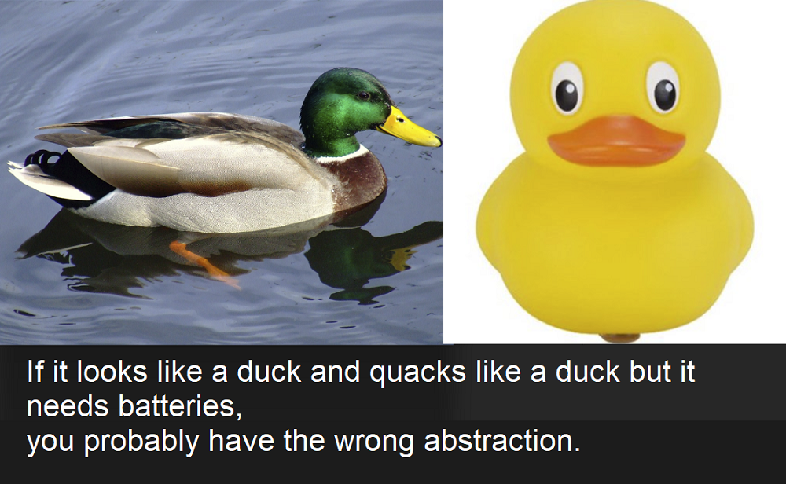
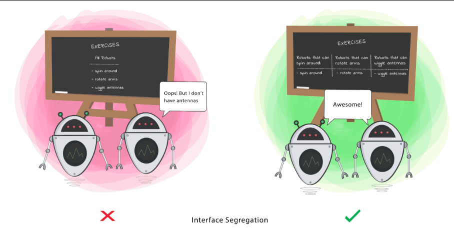
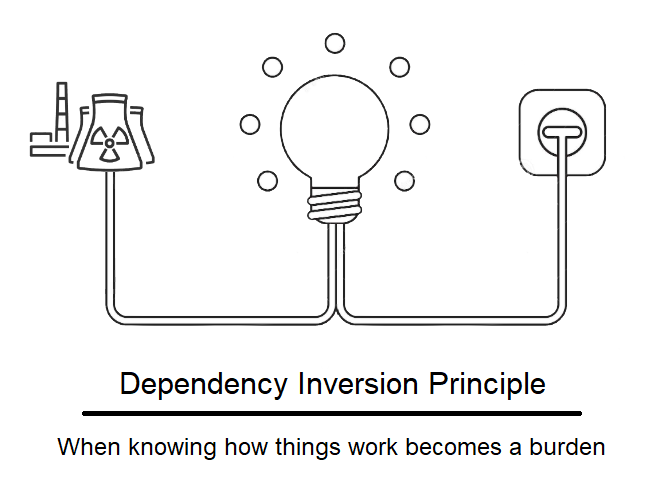

# SOLID Principles
## 1. **Liskov Substitution Principle**
> If for each object o1 of type S there is an object o2 of type T such that for all programs P defined in terms of T, the behaviour of P is unchanged when o1 is substituted for o2 then S is a subtype of T

Here **subtyping** means **Inheritance**



* When a child Class cannot perform the same actions as its parent Class, this can cause bugs.
* If you have a Class and create another Class from it, it becomes a parent and the new Class becomes a child. The child Class should be able to do everything the parent Class can do. This process is called Inheritance.
* The child Class should be able to process the same requests and deliver the same result as the parent Class or it could deliver a result that is of the same type.


***NOTE:- If the child Class doesn’t meet these requirements, it means the child Class is changed completely and violates this principle.***

## Let's take A Look n Code
### 1. Trait CoffeeMachine.scala
Make a trait so that we can overide is methods

```scala
trait CoffeeMachine {
  def serveCoffee(): Unit
}
```

### 2. BasicCoffeeMachine.scala
* BasicCoffeeMachine class extended with trait and defines it own method and override serveCoffee()
* In this way our subtype is replaced without disturbing desirable properties of program.


```scala
class BasicCoffeeMachine extends CoffeeMachine {
  val coffee="Powdered"

  override def serveCoffee(): Unit = {
    val cup = brewFilterCoffee(coffee)
    println("Here is your " + cup)
  }
  def brewFilterCoffee(coffee:String): String ={
    println("coffee is in " +coffee+" form")
    println("Brewing...")
    "Freshly brewed coffee"
  }
}
```
### 3. PremiumCoffeemachine.scala
* PremiumCoffeeMachine class extended with trait and defines it own method and override serveCoffee()

```scala
class PremiumCoffeeMachine extends CoffeeMachine {
  val coffee = "Beans"

  override def serveCoffee(): Unit = {
    val cup = brewFilterCoffee(coffee)
    println("Here is your "+cup)
  }

  def brewFilterCoffee(coffee:String): String ={
    println("coffee is in " +coffee+" form")
    println("Grinding beans")
    println("Brewing... Filtering...")
    "Freshly brewed premium Latte` coffee"
  }
}
```
### Main method
```scala
object Main extends App{
  val basic = new BasicCoffeeMachine()
  val premium = new PremiumCoffeeMachine
  premium.serveCoffee()
  basic.serveCoffee()
}
```

## Goal os LSP
This principle aims to enforce consistency so that the parent Class or its child Class can be used in the same way without any errors.


# 2. **Interface Segregation principle**

> Clients should not be forced to depend on methods that they do not use.


**Notes:-**
* When a Class is required to perform actions that are not useful, it is wasteful and may produce unexpected bugs if the Class does not have the ability to perform those actions.

* A Class should perform only actions that are needed to fulfil its role. Any other action should be removed completely or moved somewhere else if it might be used by another Class in the future.

## Code implementation of ISP
### 1. Cashier.scala
Cashier.scala is trait
```scala
trait Cashier {
  def makeBill(): Int
}
```
### 2. CoffeeMaker.scala
CoffeeMaker is a trait
```scala
trait CoffeeMaker {
  def makeCoffee(): Unit
}
```
### 3. CoffeeServer.scala
CoffeeServer.scala is a trait
```scala
trait CoffeeServer {
  def serveCoffee(): Unit
}
```
### 4. DrinkCoffee.scala
DrinkCoffee.scala is a trait
```scala
trait DrinkCoffee {
  def drinkCoffee(): Unit
}
```
### 5. CoffeeShop.scala
In this we made 3 classes to perform task related to coffee shop only that is make coffee, Serve the coffee, Billing
Extends those classes with an respective interface 
`for example: class Server extends CoffeeServer` 
```scala
class CoffeeShop extends CoffeeMaker {
  override def makeCoffee(): Unit = {
    println("Making coffee... ")
  }
}

class Server extends CoffeeServer{
  override def serveCoffee(): Unit = {
    println("Serve coffee")
  }
}

class Bill(amount:Int) extends Cashier{
  override def makeBill(): Int = {
    println("Making Bill...")
    var price = amount
    price
  }
}
```
### 6. Customer.scala
In this class we defined methods only related to customer 
We extends this class with interface DrinkCoffee and a method is defined payBill()
```scala
class Customer extends DrinkCoffee {
  override def drinkCoffee(): Unit = {
    println("drinking coffee")
  }
  def payBill(bill:Int): Unit ={
    println("Bill paid of "+bill)
  }
}

```
### Main Method
```scala
object Main extends App{
  val rahul = new Customer
  val cup = new CoffeeShop
  cup.makeCoffee()
  val server = new Server()
  server.serveCoffee()
  rahul.drinkCoffee()
  val bill = new Bill(100)
  rahul.payBill(bill.makeBill())
}
```

## Goal of ISP
This principle aims at splitting a set of actions into smaller sets so that a Class executes ONLY the set of actions it requires.


# 3. **Dependency Inversion**
> - High-level modules should not depend on low-level modules. Both should depend on the abstraction.
> - Abstractions should not depend on details. Details should depend on abstractions.



- **High-level Module(or Class):** Class that executes an action with a tool.
- **Low-level Module (or Class):** The tool that is needed to execute the action
- **Abstraction:** Represents an interface that connects the two Classes

### Principle
This principle says a Class should not be fused with the tool it uses to execute an action. Rather, it should be fused to the interface that will allow the tool to connect to the Class.

It also says that both the Class and the interface should not know how the tool works. However, the tool needs to meet the specification of the interface.

## Code implementation of DIP
### Coffeemaker.scala
Coffeemaker.scala is a trait
```scala
trait CoffeeMaker {
  def makeCoffee(): String
}
```
### Cappuccino.scala
This class extends CoffeeMaker trait to make cappuccino coffee
```scala
class Cappuccino extends CoffeeMaker {
  override def makeCoffee(): String = {
    "Makes a Cappuccino"
  }
}
```
### Latte.scala
This class extends CoffeeMaker trait to make latte coffee
```scala
class Latte extends CoffeeMaker {
  override def makeCoffee(): String = {
    "Makes a Latte"
  }
}
```
### CoffeeServer.scala

```scala
class CoffeeServer {
  def serveCoffee(coffee:CoffeeMaker): Unit ={
    val cup = coffee.makeCoffee()
    println(cup)
  }
}
```
### main method
```scala
object Main extends App{
  val serve = new CoffeeServer
  serve.serveCoffee(new Cappuccino)
  serve.serveCoffee(new Latte)
}
```
## Goal of DIP
This principle aims at reducing the dependency of a high-level Class on the low-level Class by introducing an interface.
